# Exploratory document analysis with TF-IDF, PCA and t-SNE

I analyzed my collection of scientific papers with these scripts. The scripts are 
based on Andrej Karparthy's arxiv sanity preserver:

https://github.com/karpathy/arxiv-sanity-preserver

The training data is not available in this repo, only the trained model.
Since this is real-world data, it suffers from duplicates and silly filenames.

## Instructions

Follow the readme in Karpathy's repo. I removed the functionalities 
related to serving a webpage and similarity search with SVM. I changed touch
to echo to make it work in Windows.

Rough guideline:

* install pdftotext, in case you do not have it already
* set the path variables in the config object in utils.py (e.g. location of pdf files)
* run parse_pdf_to_text.py
* run build_db_from_txt.py
* run analyze (TF-IDF takes place here)
* run visualize_tfidf.py (PCA, t-SNE and plotting): this file is splitted into
cells (supported by Spyder), check the cell headings for more info. 

In case you want to play with the model trained by me, on my papers, then you
can start fiddling with visualize_tfidf.py right away.

The document point-cloud is visualized in an interactive way in visualize_tfidf.py,
where hovering displays the filename of the training document. For this, I use
the Qt backend of matplotlib.

## What I found

With the dimensionality reduction techniques I found that my papers more or less
fall into two major categories: quantum physics and machine learning. Between
these two classes, there are roughly 15 papers, which can be considered
interdisciplinary. Some of them show up both for the "machine learning"
and "quantum" vocabulary terms, the rest are located inbetween the two clusters.

Since the papers do not have labeling on their own, for the visualization I
hand-crafted labels based on the frequency of a given term. If the transformed
frequency is above a manually-set threshold, I count the paper to be in the
class corresponding to the term (1-gram or 2-gram).

## Examples

The two major categories:

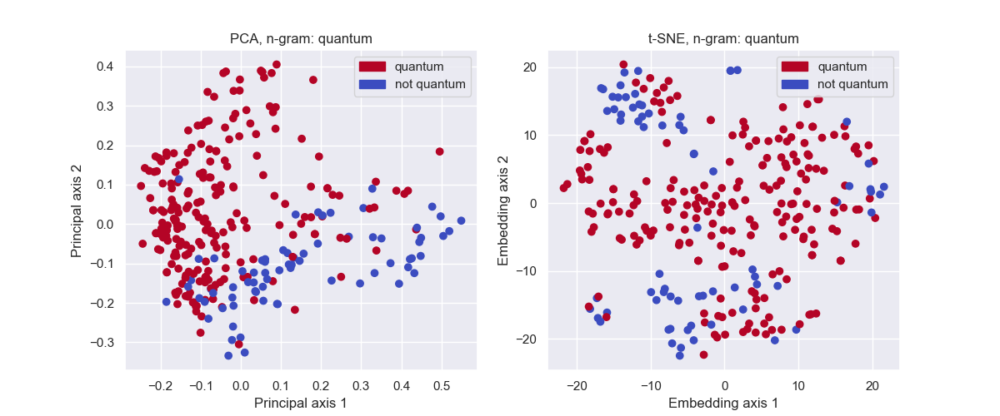

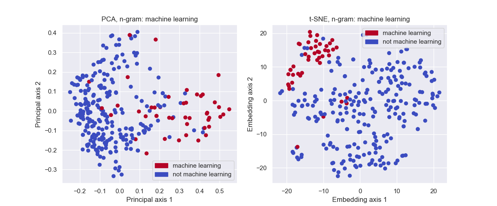

Interestingly, noise and physics is everywhere:

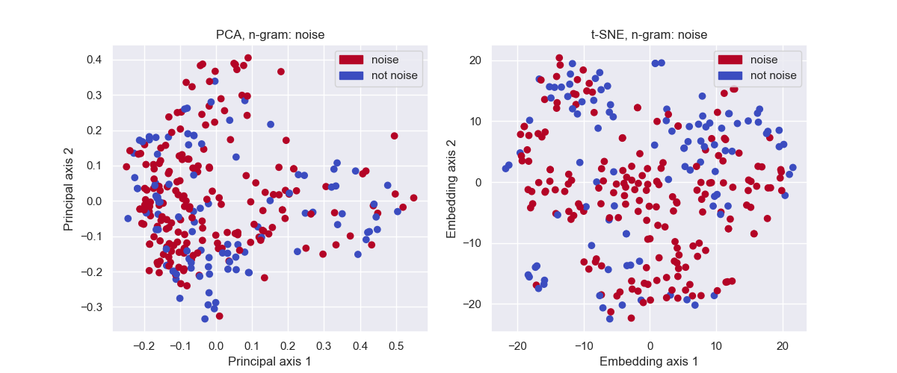

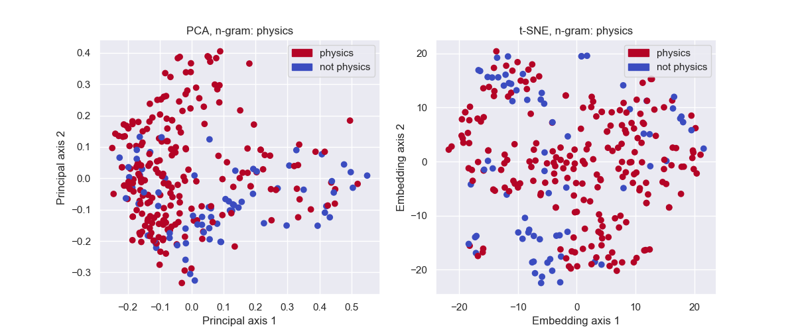

Josephson, qubit and microwave largely overlap (no surprise):

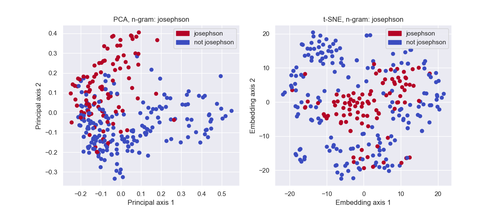

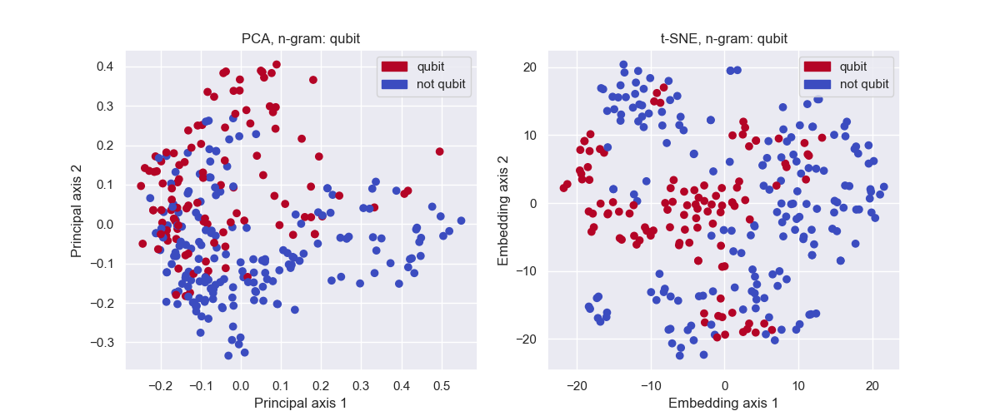

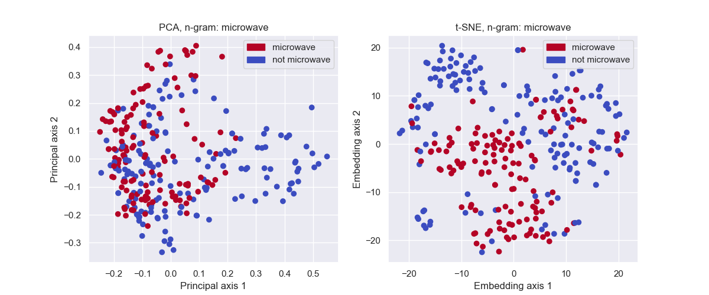

Material keywords:

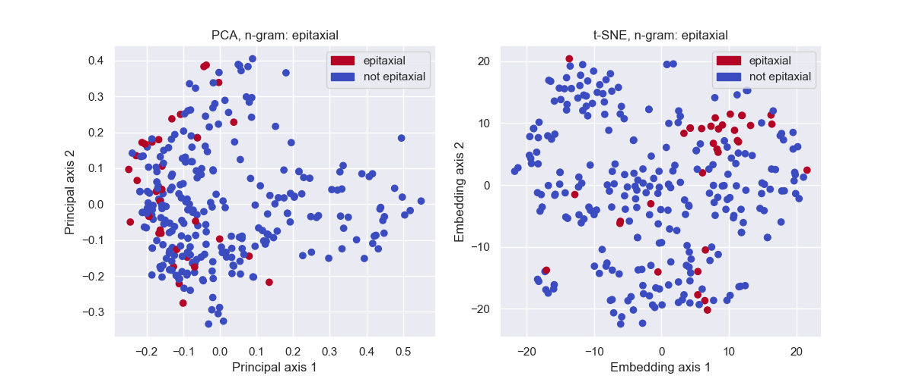

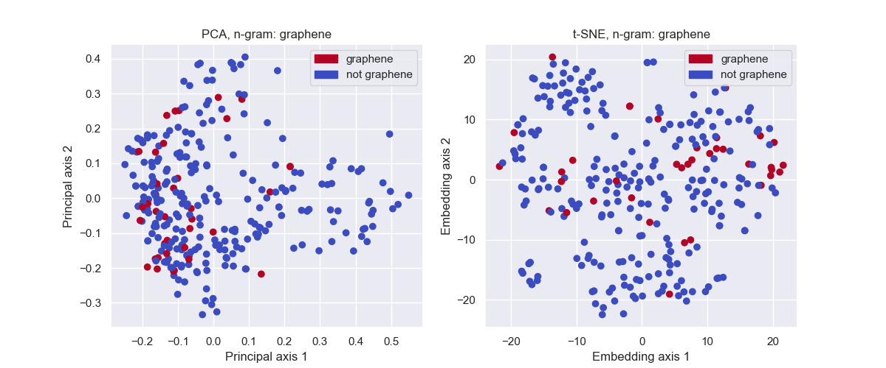

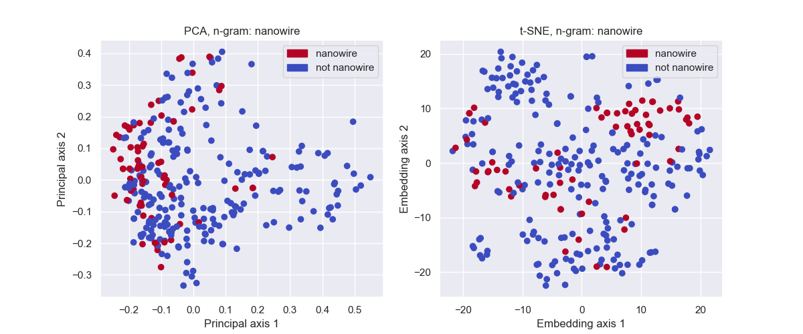

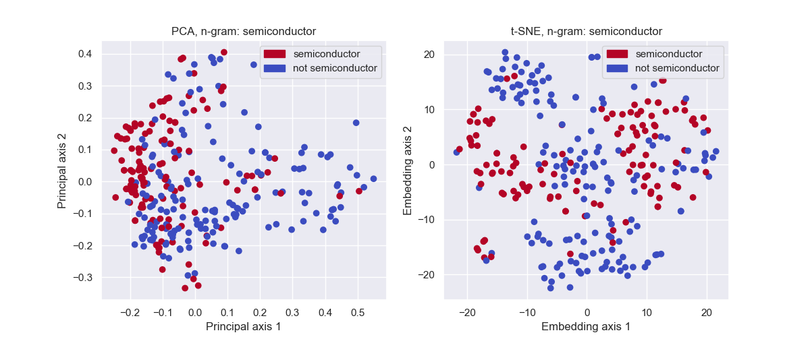

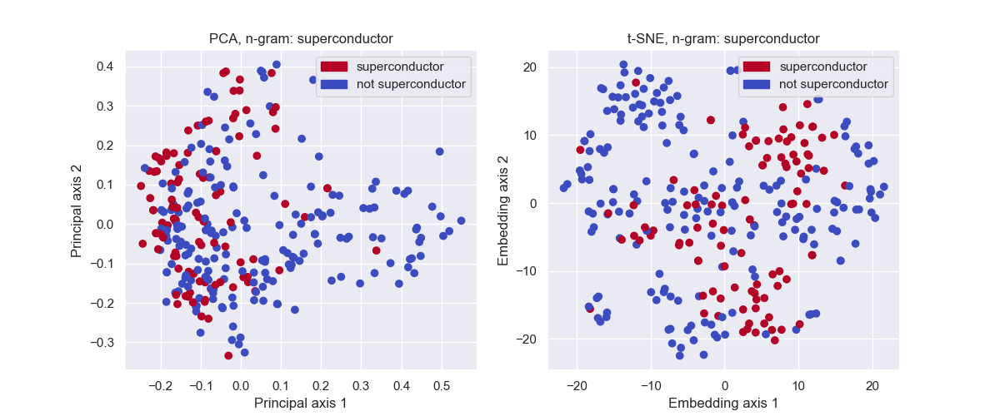

More plots:

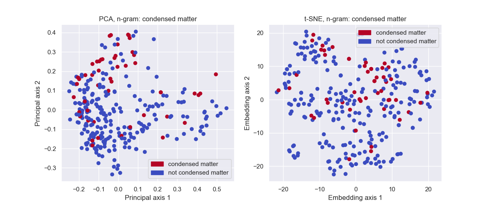

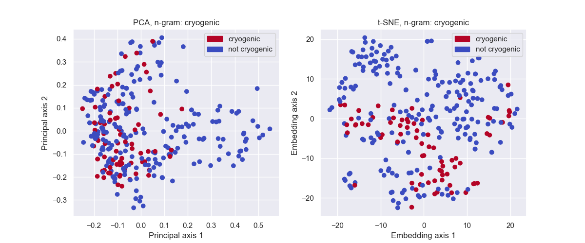

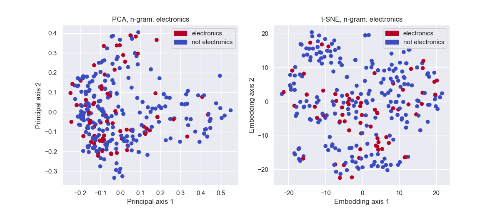

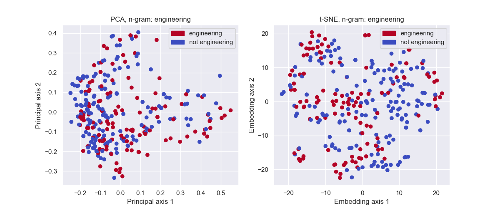

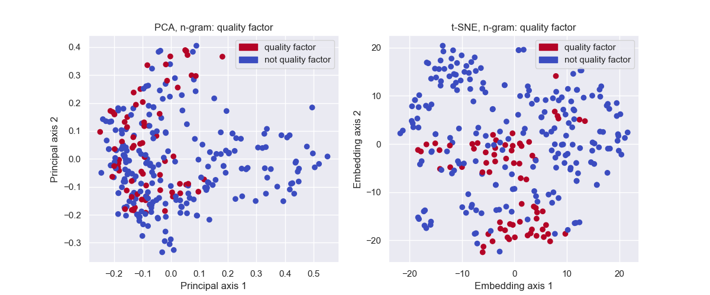

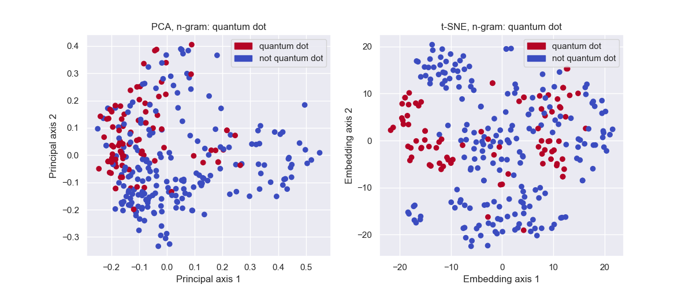

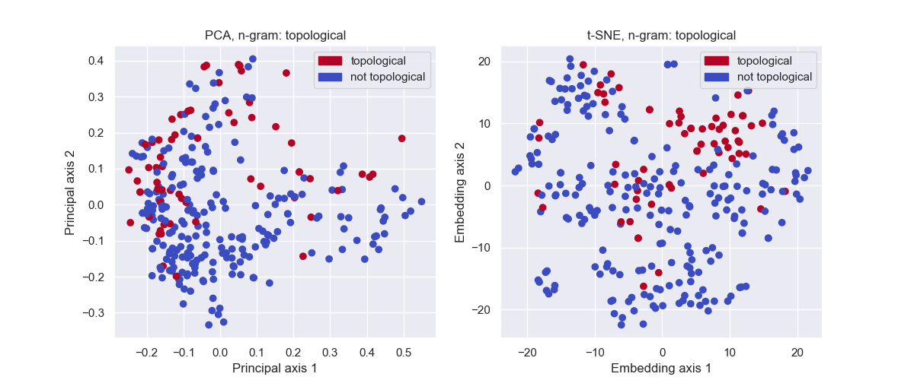
